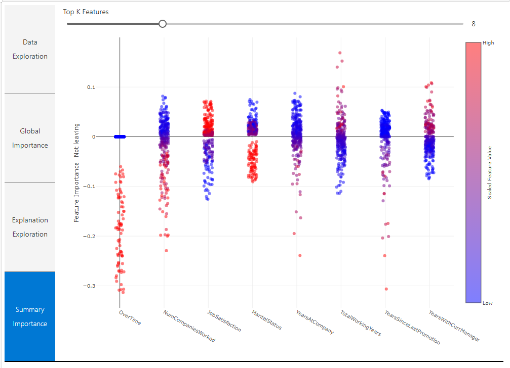
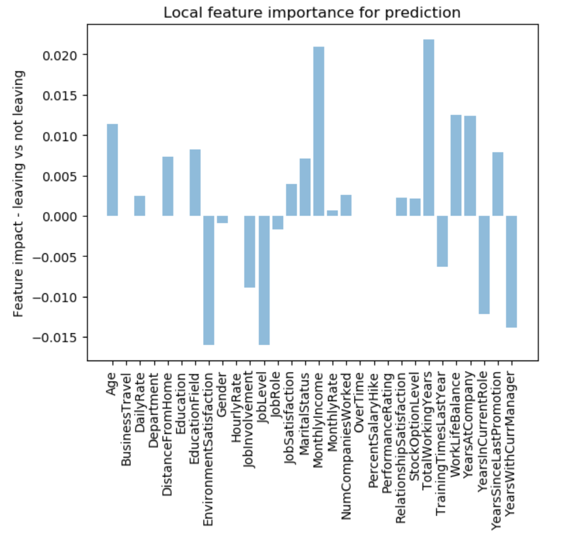

# Train & deploy a model with a built in explainer to Azure ML
This example is going to use an employee attrition dataset to help us train a model to determine the likelihood of an employee leaving a company. Beyond this, we will generate an Explanations Dashboard which helps indicate the local and global feature importance with respect to the all-up prediction.

## Train model
We're training a sklearn regression model here.

## Create explainer from trained model
The explainer is created in the script.


## Deploy model and explainer together
You can deploy the model and explainer from the CLI or the SDK. There are examples for both in this folder.

## Query deployed service to get prediction and explanation
```
import requests
import json

headers = {'Content-Type':'application/json'}

# send request to service
resp = requests.post(service.scoring_uri, sample, headers=headers)
print("prediction:", resp.text)
result = json.loads(resp.text)
```

This will return you a JSON file which contains the prediction (attrition / no attrition) and the weighted feature importance score.


If you want to reproduce this chart yourself, you can use this convenient script:
```
result = json.loads(resp.text)
labels = x_test[:1].columns.to_list()
objects = labels
y_pos = np.arange(len(objects))
performance = result["local_importance_values"][0][0]

plt.bar(y_pos, performance, align='center', alpha=0.5)
plt.xticks(y_pos, objects)
locs, labels = plt.xticks()
plt.setp(labels, rotation=90)
plt.ylabel('Feature impact - leaving vs not leaving')
plt.title('Local feature importance for prediction')

plt.show()
```
